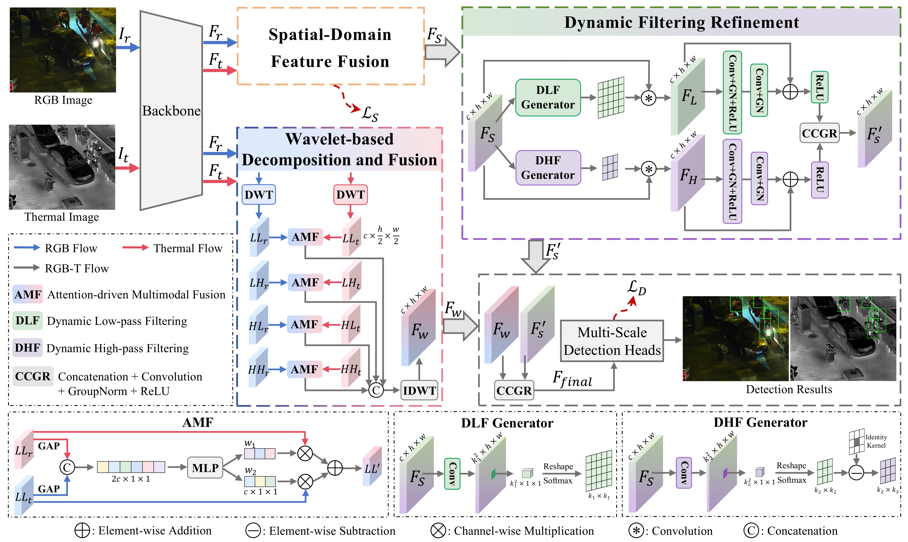

# SFS-Net: Synergistic Frequency-Spatial Network for RGB-Thermal Pedestrian Detection

This is the official repository for the manuscript. Further information will be added after the paper is accepted.

## Overview

An overview of the proposed SFS-Net framework is shown below.

*Overview of the proposed SFS-Net framework.*
